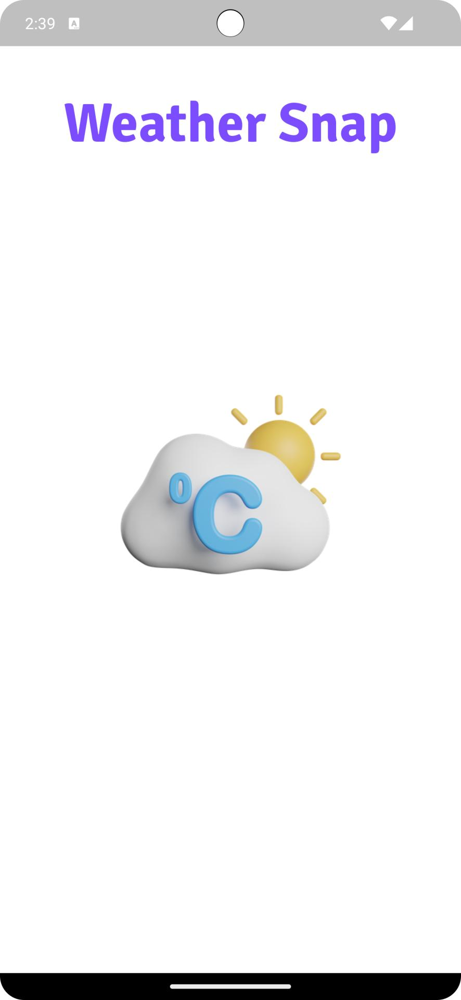
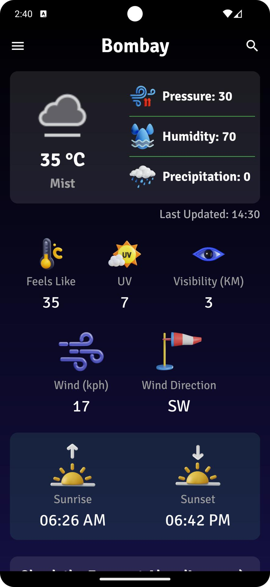
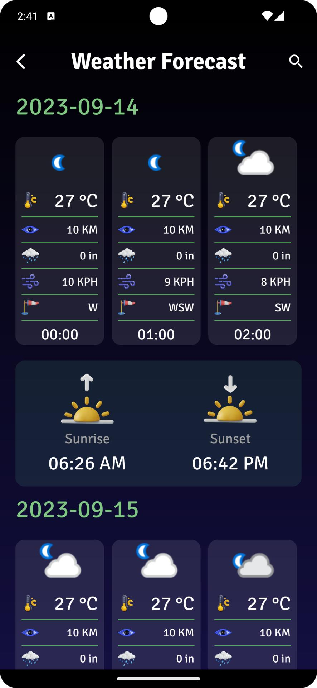
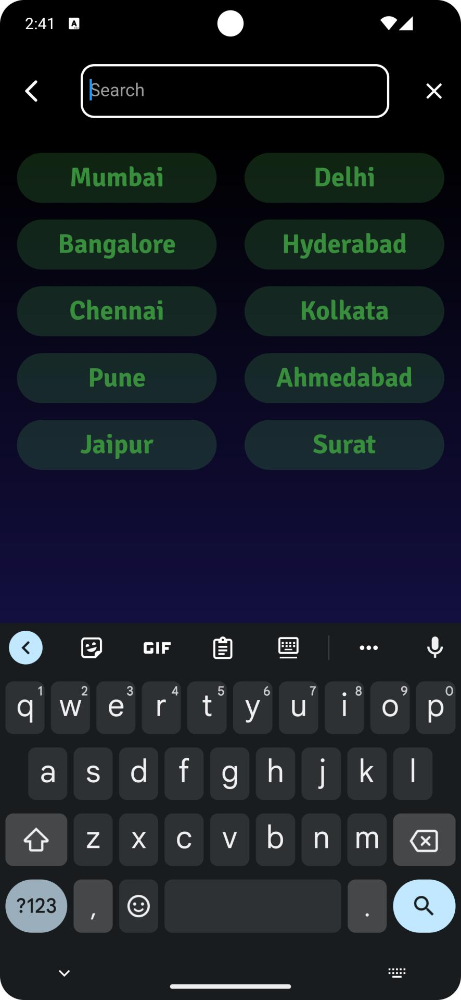
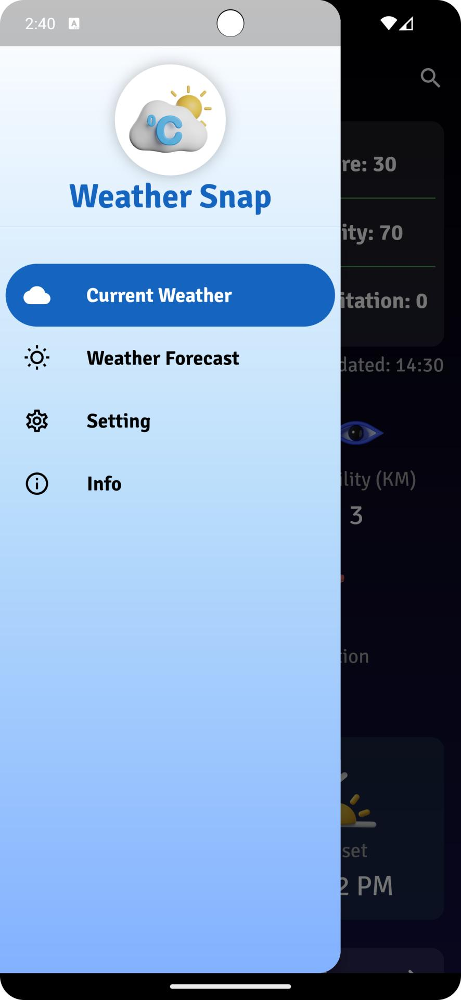
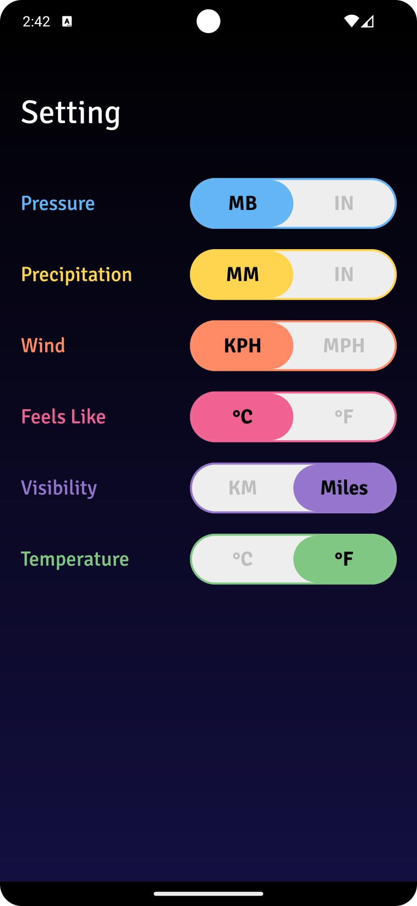
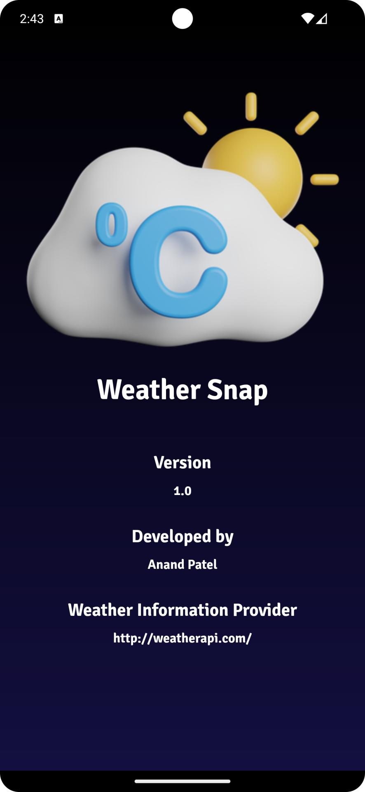

# Weather-Snap

## Overview

<b>Weather Snap is an innovative weather forecasting app designed to provide users with up-to-date weather information right at their fingertips. With an extensive range of features including real-time weather updates, 3-day forecasts, city search, unit conversion, and personalized weather reports, Weather Snap is your go-to weather companion. Stay prepared with Weather Snap – your ultimate weather forecasting tool.</b>

## Technology Used

- Flutter
- Dart
- Provider
- Rest API

## Installation

### Prerequisites

<b>Flutter:</b> Ensure you have Flutter installed on your development machine. You can find installation instructions at flutter.dev.

### Getting Started

<b>1. Clone the Weather Snap repository to your local machine.</b>

```
https://github.com/Anand-s-FlutterLab/Weather-Snap.git
```

<b>2. Install the project dependencies using Flutter's package manager, pub.</b>

```
flutter pub get
```

<b>3. Build and run the Flutter app on your preferred platform (iOS or Android).</b>

```
flutter run
```

## Features

The Weather Snap offers a range of features, including:

- Real-time weather updates
- 3-day forecasts
- City search
- Unit conversion
- Personalized weather reports

## Screenshots

<p align="center">



</p>
<br>
<p align="center">



</p>
<br>
<p align="center">


</p>
<br>
